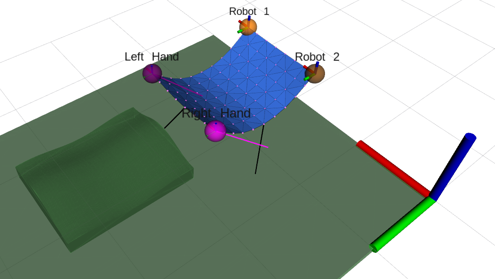
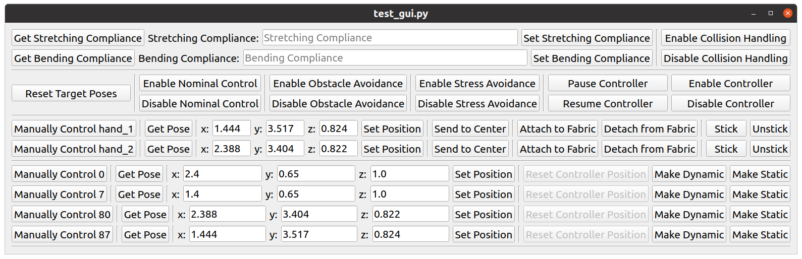

# deformable_manipulations_composite_layup



## Velocity Controller

## GUI and Voice Commands



### Installation Prerequisites for the Voice Commands to work

For the voice commands to work these packages must be pre-installed on the GUI computer
```bash
pip3 install SpeechRecognition 
sudo apt-get install python3-pyaudio #(or pip3 install pyaudio)
pip3 install pocketsphinx #(for offline speech recognition)
pip3 install pyttsx3 #(for text-to-speech - OFFLINE)
pip3 install gtts #(for text-to-speech - Google's ONLINE)
sudo apt install ffmpeg #(for playing the audio from online gtts using ffplay command)
```


### List of Voice Commands

Copied the implemented voice commands from `fabric_simulator/scripts/test_gui.py`:
Warning: Below commands can be outdated anytime..

```python
self.voice_command_actions = {
    "get stretching compliance": self.get_stretching_compliance_button_click,
    "get bending compliance": self.get_bending_compliance_button_click,
    
    "enable collision handling": self.enable_collision_button_click,
    
    "disable collision handling": self.disable_collision_button_click,
    
    "reset target poses": self.reset_target_poses_button_click,
    
    "enable nominal control": self.enable_nominal_control_button_click,
    
    "disable nominal control": self.disable_nominal_control_button_click,
    
    "enable obstacle avoidance": self.enable_obstacle_avoidance_button_click,
    "enable collision avoidance": self.enable_obstacle_avoidance_button_click,
    
    "disable obstacle avoidance": self.disable_obstacle_avoidance_button_click,
    "disable collision avoidance": self.disable_obstacle_avoidance_button_click,
    
    "enable stress avoidance": self.enable_stress_avoidance_button_click,
    
    "disable stress avoidance": self.disable_stress_avoidance_button_click,
    
    "pause controller": self.pause_controller_button_click,
    
    "resume controller": self.resume_controller_button_click,
    
    "enable controller": self.enable_controller_button_click,
    
    "disable controller": self.disable_controller_button_click,
    
    "attach left hand": self.attach_left_hand_button_click,
    "attached left hand": self.attach_left_hand_button_click,
    
    "detach left hand": self.detach_left_hand_button_click,
    "detached left hand": self.detach_left_hand_button_click,
    
    "attach right hand": self.attach_right_hand_button_click,
    "attached right hand": self.attach_right_hand_button_click,
    
    "detach right hand": self.detach_right_hand_button_click,
    "detached right hand": self.detach_right_hand_button_click,
    
    "stick left": self.stick_left_button_click,
    
    "unstick left": self.unstick_left_button_click,
    
    "stick right": self.stick_right_button_click,
    "unstick right": self.unstick_right_button_click,
    
    "get left corner position": self.get_left_corner_pose_from_particle,
    
    "get right corner position": self.get_right_corner_pose_from_particle,
    
    "set left position": self.set_left_position_button_click,
    
    "set right position": self.set_right_position_button_click,
    
    "enable layup mode": self.enable_layup_mode_button_click,
    
    "disable layup mode": self.disable_layup_mode_button_click,
    
    "switch to layup mode": self.switch_to_layup_mode,
    
    "switch to follower mode": self.switch_to_follower_mode,
    # Add more voice commands here ..
}
```

### Initialization voice commands after the initial launch in simulation:

- `get right corner position` --> Obtains the positon of the RIGHT corner position of the fabric from sim, which is the corner that the operator assumed to hold with their RIGHT hand, and writes its values to the GUI's Manually Control hand_1 row.
- `get left corner position` --> Obtains the positon of the LEFT corner position of the fabric from sim, which is the corner that the operator assumed to hold with their LEFT hand, and writes its values to the GUI's Manually Control hand_2 row.
- `set right position` --> Sends the virtual RIGHT hand position to the position written in the GUI's Manually Control hand_1 row, which is the right corner of the fabric in this order.
- `set left position` --> Sends the virtual LEFT hand position to the position written in the GUI's Manually Control hand_2 row, which is the left corner of the fabric in this order.
- `attach right hand` --> Fixes the particle of the fabric within the radius of the hand ball shown in RViz to the RIGHT hand frame, in this case the attached particle is the the RIGHT corner of the fabric.
- `attach left hand` --> Fixes the particle of the fabric within the radius of the hand ball shown in RViz to the LEFT hand frame, in this case the attached particle is the the LEFT corner of the fabric.
- CLICK the `Manually Control hand_1` and `Manually Control hand_2` buttons to enable control of the virtual hands with the spacemice (or rqt_ez_publisher)
- `reset target poses` --> Resets the relative position between the right hand position and the robot positions. This relative poses fixed to the right hand position is the leader that the robots follow as target.
- `switch to follower mode` --> By default initially the sytem is in the follower mode however as a general practice it is safer to ensure that by saying this command.
- `enable controller` --> Enables the controller. Also initiates the rosbag recording of the experiment. Watch out for the too large bag files if the experiment takes too long time. Especially because of the full fabric state and camera images recording. They are the largest data types recorded in this setup.
- `pause controller` --> Temporarily pauses the the reactive behavior of the controller for the operator to do adjustments, for example, in the hand configurations. Rosbag file recording does NOT stop with this command.
- `switch to layup mode` (or `disable collision avoidance` + `enable layup mode`) --> Switches to layup mode allowing the collisions because we will need contact with the surface and the fabric.
- `resume controller` --> Reactive behavior of the controller is reenabled.
- `detach left hand` --> Drops the material's left corner on the surface
- `detach right hand` --> Drops the material completely on the surface after alignment adjustments.
- `stick left` + `stick right` --> ...
- `disable controller` --> Concludes the experiment, stops the controller, saves and closes the recording rosbag files.